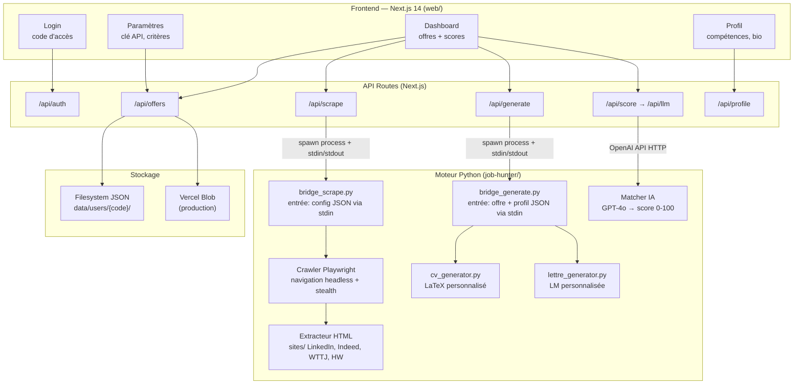
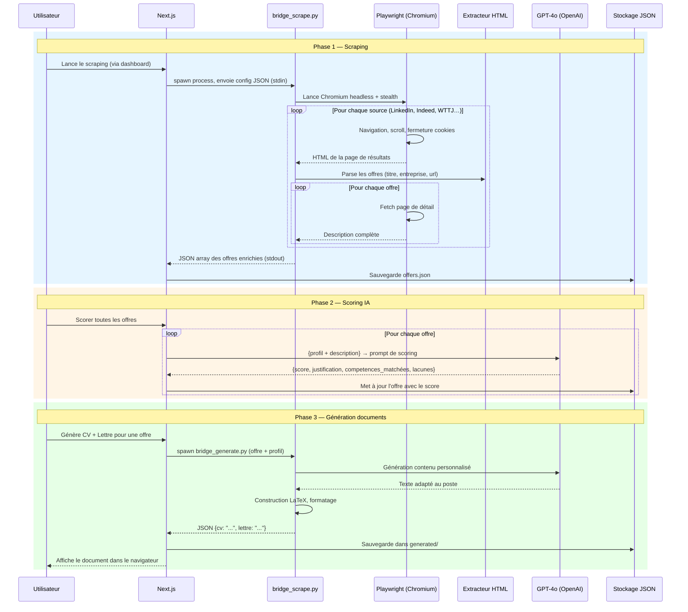
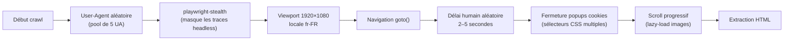
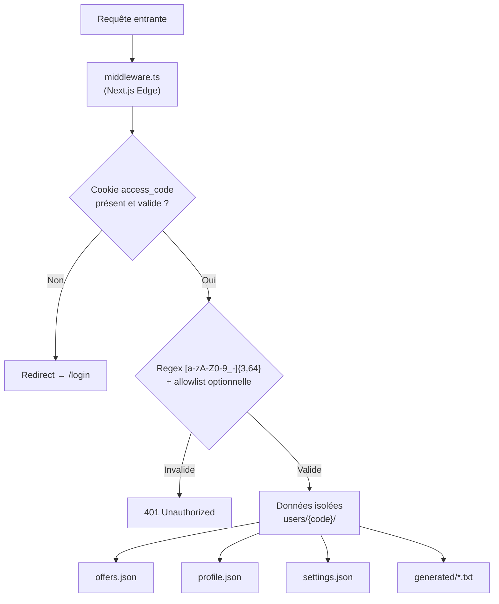
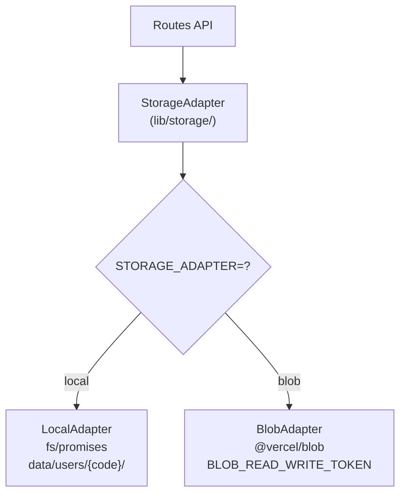

# Job Hunter — Architecture & Implémentation

> Outil full-stack de veille d'emploi : scraping Playwright, scoring IA OpenAI, génération de CV/LM LaTeX, interface web Next.js 14.

---

## Architecture du projet



---

## Pipeline de traitement — Séquence complète



---

## Anti-détection — Stratégie Playwright



---

## Système d'authentification



---

## Adaptateur de stockage — Abstraction locale/Blob



---

## Stack technique complète

| Couche | Techno | Choix technique |
|---|---|---|
| UI | **Next.js 14** App Router | SSR + API routes dans un seul projet |
| Style | **Tailwind CSS** | Utility-first, aucun composant externe |
| Scraping | **Playwright** + **playwright-stealth** | Contourne les détections headless |
| Parsing HTML | **BeautifulSoup4** | Extraction robuste par sélecteurs CSS/XPath |
| IA | **OpenAI GPT-4o** | Scoring sémantique + génération de texte |
| Documents | **LaTeX** | PDF professionnels reproductibles |
| Stockage | **JSON fichier** / **Vercel Blob** | Zéro dépendance DB, multi-provider |
| Auth | **Cookie httpOnly** + code d'accès | Stateless, sans base d'utilisateurs |
| IPC Python↔Node | **spawn + stdin/stdout** | Bridge léger, pas de serveur Python dédié |
| Deploy | **Docker**, **Railway**, **Vercel** | Flexible selon l'environnement |

---

---

## Architecture

```
job-hunter/
├── scraper/            → Scrapers Playwright (LinkedIn, Indeed, WTTJ, HelloWork)
├── ai/                 → Scoring IA + génération CV/lettre (OpenAI)
├── latex/              → Template CV source (cv_base.tex)
├── db/                 → Base SQLite (dashboard Flask legacy)
├── dashboard/          → Dashboard Flask (interface legacy)
├── bridge_scrape.py    → Bridge Python → appelé par l'API Next.js pour scraper
├── bridge_generate.py  → Bridge Python → appelé par l'API Next.js pour générer LaTeX
├── config.yaml         → Config principale (profil, sources, OpenAI, critères de recherche)
├── run.py              → Point d'entrée CLI (scraping, scoring, génération)
└── web/                → Application web Next.js (interface principale)
    ├── src/
    │   ├── app/        → Pages et routes API (App Router)
    │   ├── components/ → Composants React
    │   └── lib/        → Types, auth, storage adapter
    └── data/
        └── users/      → Données utilisateurs (JSON, isolées par code d'accès)
```

---

## Prérequis

| Outil | Version minimale |
|---|---|
| Node.js | 18+ |
| Python | 3.11+ |
| npm | 9+ |

---

## Installation

### 1. Cloner le projet

```bash
git clone <repo-url>
cd job-hunter
```

### 2. Installer les dépendances Python

```bash
pip install -r requirements.txt
```

Installer aussi les navigateurs Playwright (nécessaire pour le scraping réel) :

```bash
playwright install chromium
```

### 3. Installer les dépendances Node.js

```bash
cd web
npm install
```

### 4. Configurer

#### config.yaml (scraper Python)

Copier l'exemple et l'adapter :

```bash
cp config.example.yaml config.yaml
```

Les champs importants :

```yaml
openai:
  api_key: "sk-..."       # Votre clé OpenAI

sources:
  - nom: "LinkedIn"
    url: "https://www.linkedin.com/jobs/search/?keywords=..."
    actif: true
  - nom: "Indeed"
    url: "https://fr.indeed.com/jobs?q=..."
    actif: true
```

#### Variables d'environnement Next.js (optionnel)

Créer `web/.env.local` si besoin :

```env
# Stockage : "local" (filesystem) ou "blob" (Vercel Blob)
STORAGE_ADAPTER=local

# Codes d'accès autorisés (vide = tout code valide accepté)
ALLOWED_CODES=
```

Par défaut, tout code alphanumérique est accepté et les données sont stockées dans `web/data/users/{code}/`.

---

## Lancer en local

### Interface web (Next.js)

```bash
cd web
npm run dev
```

Ouvrir **http://localhost:3000**

### Flux d'utilisation dans l'interface

1. **Se connecter** — saisir un code d'accès (ex : `Abde`)
2. **Profil** — remplir nom, compétences, expérience
3. **Paramètres** — coller sa clé OpenAI, configurer les critères de recherche et éventuellement ajouter des URLs de sites supplémentaires
4. **Dashboard → Lancer le scraping** — scrape les sites configurés dans `config.yaml` + les URLs ajoutées dans l'interface
5. **Scorer les offres** — scoring IA 0-100 pour chaque offre par rapport au profil
6. **Cliquer sur une offre** — ouvrir le panneau de détail : infos complètes, score, lien source, génération CV LaTeX et lettre de motivation

---

## Lancer le scraper en CLI (sans interface web)

Toutes les commandes depuis le dossier `job-hunter/` :

```bash
# Toutes les phases (scraping + scoring + génération CV)
python run.py

# Phase 1 uniquement : scraping
python run.py scrape

# Phase 2 uniquement : scoring IA
python run.py match

# Phase 3 : génération CV LaTeX
python run.py cv

# Phase 3b : génération lettres de motivation
python run.py lettre

# Lancer l'ancien dashboard Flask (port 5000)
python run.py dashboard
```

---

## Génération LaTeX

Les CVs et lettres générés sont des fichiers `.tex` compilables avec `pdflatex` ou `latexmk`.

Pour compiler manuellement un `.tex` en PDF :

```bash
latexmk -pdf latex/generated/CV_Entreprise_Poste.tex
# ou
pdflatex latex/generated/CV_Entreprise_Poste.tex
```

Installer TeX Live (Linux/macOS) ou MiKTeX (Windows) si nécessaire.

---

## Déploiement Vercel (production)

1. Pousser le dossier `web/` sur un repo Git
2. Connecter à Vercel
3. Définir les variables d'environnement :

```
STORAGE_ADAPTER=blob
BLOB_READ_WRITE_TOKEN=<votre token Vercel Blob>
ALLOWED_CODES=alice,bob   # optionnel
```

4. Déployer

> En production, le scraping Python ne s'exécute pas sur Vercel (serverless). Utiliser le CLI ou un serveur dédié pour le scraping, et pointer vers les données via le Blob Storage.

---

## Variables d'environnement récapitulatif

| Variable | Valeur par défaut | Description |
|---|---|---|
| `STORAGE_ADAPTER` | `local` | `local` = filesystem, `blob` = Vercel Blob |
| `BLOB_READ_WRITE_TOKEN` | — | Token Vercel Blob (production uniquement) |
| `ALLOWED_CODES` | *(vide)* | Liste de codes autorisés séparés par virgule. Vide = tous acceptés |
